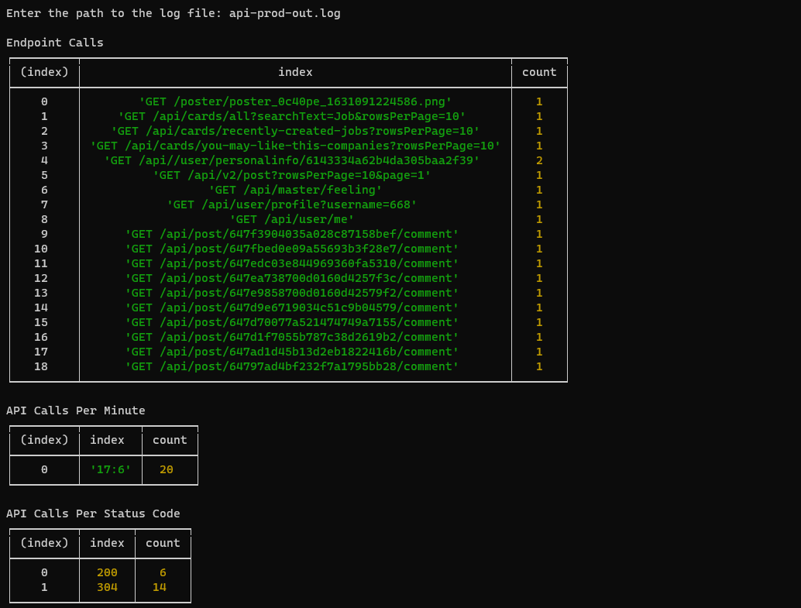

# unomok
Assignment submission for UNOMOK

This project helps you analyse your logs.



## steps to run

globally install ts-node
```npm install -g ts-node
```

install necessary packages

```
npm i
```

run using 

```
ts-node index.js
```

you will be asked to enter the location of your log file

type the location and then press enter